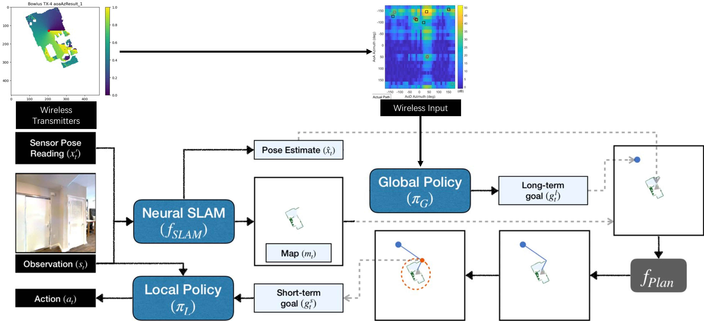

# PIRL-WIN
<!-- ALL-CONTRIBUTORS-BADGE:START - Do not remove or modify this section -->
<!-- ALL-CONTRIBUTORS-BADGE:END -->
## Source code for [*Zero-Shot Wireless Indoor Navigation through Physics-Informed Reinforcement Learning.*]([https://github.com/Panshark/PIRL-WIN/blob/main/docs/Zero-Shot_Wireless_Indoor_Navigation_through_Physics-Informed_Reinforcement_Learning.pdf](https://github.com/Panshark/PIRL-WIN/blob/main/docs/Zero-Shot_Wireless_Indoor_Navigation_through_Physics-Informed_Reinforcement_Learning.pdf)) 

[](https://github.com/RichardLitt/standard-readme)
<!-- ALL-CONTRIBUTORS-BADGE:START - Do not remove or modify this section -->
[](#contributors-)

The structure of Neural-SLAM is based on [Neural-SLAM](https://devendrachaplot.github.io/projects/Neural-SLAM).

## Table of Contents

- [Background](#background)
- [Dependencies](#dependencies)
- [Setup](#setup)
- [Usage](#usage)
- [References](#references)
	- [Citing](#citing)
- [Maintainers](#maintainers)
- [Contributing](#contributing)
	- [Contributors](#contributors)
- [License](#license)

## Background


The growing focus on indoor robot navigation utilizing wireless signals has stemmed from the capability of these signals to capture high-resolution angular and temporal measurements.  Prior heuristic-based methods, based on radio frequency propagation, are intuitive and generalizable across simple scenarios, yet fail to navigate in complex environments. On the other hand, end-to-end (e2e) deep reinforcement learning (RL), powered by advanced computing machinery, can explore the entire state space, delivering surprising performance when facing complex wireless environments. However, the price to pay is the astronomical amount of training samples, and the resulting policy, without fine-tuning (zero-shot), is unable to navigate efficiently in new scenarios unseen in the training phase. To equip the navigation agent with sample-efficient learning and {zero-shot} generalization, this work proposes a novel physics-informed RL (PIRL) where a distance-to-target-based cost (standard in e2e) is augmented with physics-informed reward shaping. The key intuition is that wireless environments vary, but physics laws persist. After learning to utilize the physics information, the agent can transfer this knowledge across different tasks and navigate in an unknown environment without fine-tuning. The proposed PIRL is evaluated using a wireless digital twin (WDT) built upon simulations of a large class of indoor environments from the AI Habitat dataset augmented with electromagnetic (EM) radiation  simulation for wireless signals.  It is shown that the PIRL significantly outperforms both e2e RL and heuristic-based solutions in terms of generalization and performance.


## Dependencies
We use earlier versions of [habitat-sim](https://github.com/facebookresearch/habitat-sim) and [habitat-api](https://github.com/facebookresearch/habitat-api). The specific commits are mentioned below.

Installing habitat-sim:
```
git clone https://github.com/facebookresearch/habitat-sim.git
cd habitat-sim; git checkout 9575dcd45fe6f55d2a44043833af08972a7895a9; 
pip install -r requirements.txt; 
python setup.py install --headless
python setup.py install # (for Mac OS)

```

Installing habitat-api:
```
git clone https://github.com/facebookresearch/habitat-api.git
cd habitat-api; git checkout b5f2b00a25627ecb52b43b13ea96b05998d9a121; 
pip install -e .
```

Install pytorch from https://pytorch.org/ according to your system configuration. The code is tested on pytorch v1.2.0. If you are using conda:
```
conda install pytorch==1.2.0 torchvision cudatoolkit=10.0 -c pytorch #(Linux with GPU)
conda install pytorch==1.2.0 torchvision==0.4.0 -c pytorch #(Mac OS)
```

## Setup
Clone the repository and install other requirements:
```
git clone --recurse-submodules https://github.com/Panshark/PIRL-WIN.git
cd PIRL-WIN;
pip install -r requirements.txt
```

The code requires datasets in a `data` folder in the following format (same as habitat-api):
```
Neural-SLAM/
  data/
    scene_datasets/
      gibson/
        Adrian.glb
        Adrian.navmesh
        ...
    datasets/
      pointnav/
        gibson/
          v1/
            train/
            val/
            ...
```
Please download the data using the instructions here: https://github.com/facebookresearch/habitat-api#data

To verify that dependencies are correctly installed and data is setup correctly, run:
```
python main.py -n1 --auto_gpu_config 0 --split val
```


## Usage

### Training:
For training the complete Active Neural SLAM model on the Exploration task:
```
python main.py
```

### Downloading pre-trained models
```
mkdir pretrained_models;
wget --no-check-certificate 'https://drive.google.com/uc?export=download&id=1UK2hT0GWzoTaVR5lAI6i8o27tqEmYeyY' -O pretrained_models/model_best.global;
wget --no-check-certificate 'https://drive.google.com/uc?export=download&id=1A1s_HNnbpvdYBUAiw2y1JmmELRLfAJb8' -O pretrained_models/model_best.local;
wget --no-check-certificate 'https://drive.google.com/uc?export=download&id=1o5OG7DIUKZyvi5stozSqRpAEae1F2BmX' -O pretrained_models/model_best.slam;
```

### For evaluation:
For evaluating the pre-trained models:
```
python main.py --split val --eval 1 --train_global 0 --train_local 0 --train_slam 0 \
--load_global pretrained_models/model_best.global \
--load_local pretrained_models/model_best.local \
--load_slam pretrained_models/model_best.slam 
```

For visualizing the agent observations and predicted map and pose, add `-v 1` as an argument to the above

For more detailed instructions, see [INSTRUCTIONS](./docs/INSTRUCTIONS.md).


## References
You can find the full paper [here](https://arxiv.org/abs/2306.06766).

### Citing:

If you find this work useful in your research, please cite:

```bibtex
@misc{yin2023zeroshot,
      title={Zero-Shot Wireless Indoor Navigation through Physics-Informed Reinforcement Learning}, 
      author={Mingsheng Yin and Tao Li and Haozhe Lei and Yaqi Hu and Sundeep Rangan and Quanyan Zhu},
      year={2023},
      eprint={2306.06766},
      archivePrefix={arXiv},
      primaryClass={cs.RO}
}

```

## Maintainers

[@Haozhe Lei](https://github.com/Panshark).

## Contributing

Feel free to dive in! [Open an issue](https://github.com/Panshark/Attack_metaRL/issues/new) or submit PRs.

Standard Readme follows the [Contributor Covenant](http://contributor-covenant.org/version/1/3/0/) Code of Conduct.

### Contributors ✨

Thanks goes to these wonderful people ([emoji key](https://allcontributors.org/docs/en/emoji-key)):

<!-- ALL-CONTRIBUTORS-LIST:START - Do not remove or modify this section -->
<!-- prettier-ignore-start -->
<!-- markdownlint-disable -->

<table>
  <tr>
    
  </tr>
</table>

<table>
  <tbody>
    <tr>
	    <td align="center"><a href="https://github.com/Panshark"><br /><sub><b>Haozhe Lei</b></sub></a><br /><a href="https://github.com/Panshark/Attack_metaRL/commits?author=Panshark" title="Code">💻</a> <a href="#data-Panshark" title="Data">🔣</a> <a href="https://github.com/Panshark/Attack_metaRL/commits?author=Panshark" title="Documentation">📖</a> <a href="#ideas-Panshark" title="Ideas, Planning, & Feedback">🤔</a> <a href="#maintenance-Panshark" title="Maintenance">🚧</a> <a href="#projectManagement-Panshark" title="Project Management">📆</a> <a href="https://github.com/Panshark/Attack_metaRL/pulls?q=is%3Apr+reviewed-by%3APanshark" title="Reviewed Pull Requests">👀</a> <a href="#design-Panshark" title="Design">🎨</a></td>
    <td align="center"><a href="https://engineering.nyu.edu/student/tao-li-0"><br /><sub><b>Tao Li</b></sub></a><br /><a href="#design-TaoLi-NYU" title="Design">🎨</a> <a href="#eventOrganizing-TaoLi-NYU" title="Event Organizing">📋</a> <a href="#ideas-TaoLi-NYU" title="Ideas, Planning, & Feedback">🤔</a> <a href="#data-TaoLi-NYU" title="Data">🔣</a> <a href="#content-TaoLi-NYU" title="Content">🖋</a> <a href="#question-TaoLi-NYU" title="Answering Questions">💬</a></td>
      <td align="center"><a href="https://github.com/MingshengYin"><br /><sub><b>MINGSHENG YIN</b></sub></a><br /><a href="#data-MingshengYin" title="Data">🔣</a> <a href="https://github.com/Panshark/PIRL-WIN/commits?author=MingshengYin" title="Code">💻</a> <a href="https://github.com/Panshark/PIRL-WIN/issues?q=author%3AMingshengYin" title="Bug reports">🐛</a> <a href="#ideas-MingshengYin" title="Ideas, Planning, & Feedback">🤔</a> <a href="#research-MingshengYin" title="Research">🔬</a> <a href="#example-MingshengYin" title="Examples">💡</a><a href="#design-MingshengYin" title="Design">🎨</a></td>
    </tr>
  </tbody>
</table>

<!-- markdownlint-restore -->
<!-- prettier-ignore-end -->

<!-- ALL-CONTRIBUTORS-LIST:END -->

This project follows the [all-contributors](https://github.com/all-contributors/all-contributors) specification. Contributions of any kind are welcome!

## License

[](https://github.com/Panshark/PIRL-WIN/blob/main/LICENSE) [MIT](https://github.com/Panshark/PIRL-WIN/blob/main/LICENSE) © Haozhe Lei

## Contributors ✨

Thanks goes to these wonderful people ([emoji key](https://allcontributors.org/docs/en/emoji-key)):

<!-- ALL-CONTRIBUTORS-LIST:START - Do not remove or modify this section -->
<!-- prettier-ignore-start -->
<!-- markdownlint-disable -->
<!-- markdownlint-restore -->
<!-- prettier-ignore-end -->
<!-- ALL-CONTRIBUTORS-LIST:END -->

This project follows the [all-contributors](https://github.com/all-contributors/all-contributors) specification. Contributions of any kind welcome!
